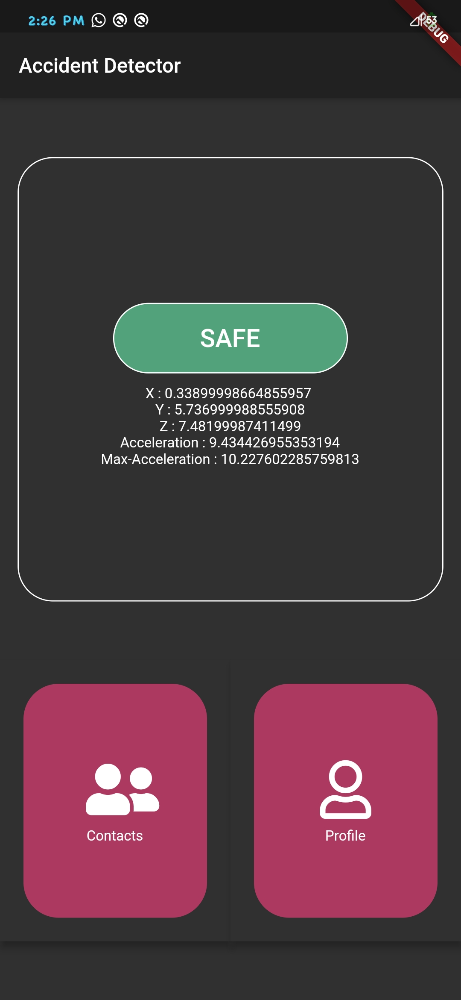
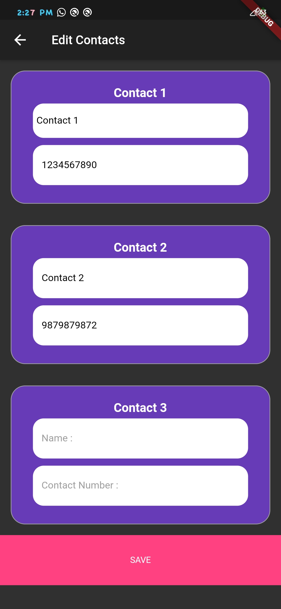
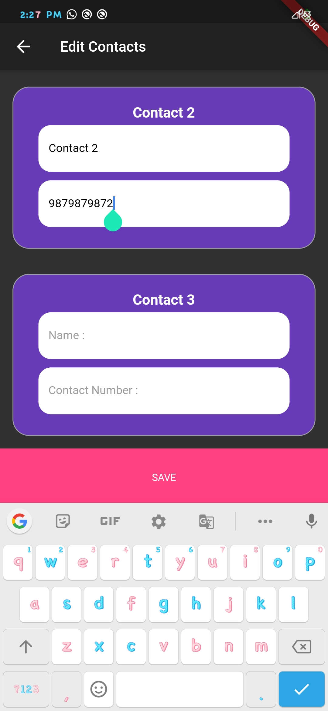
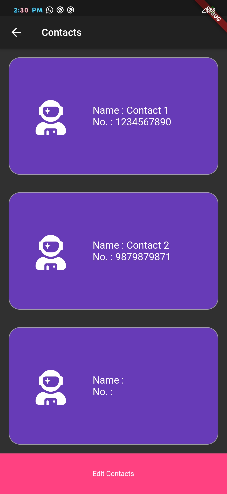
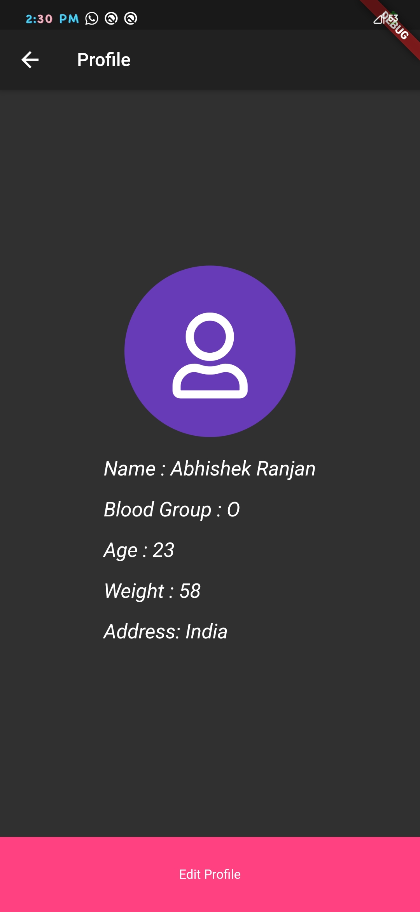
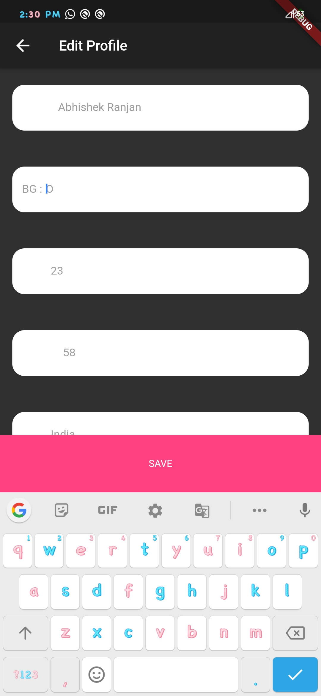
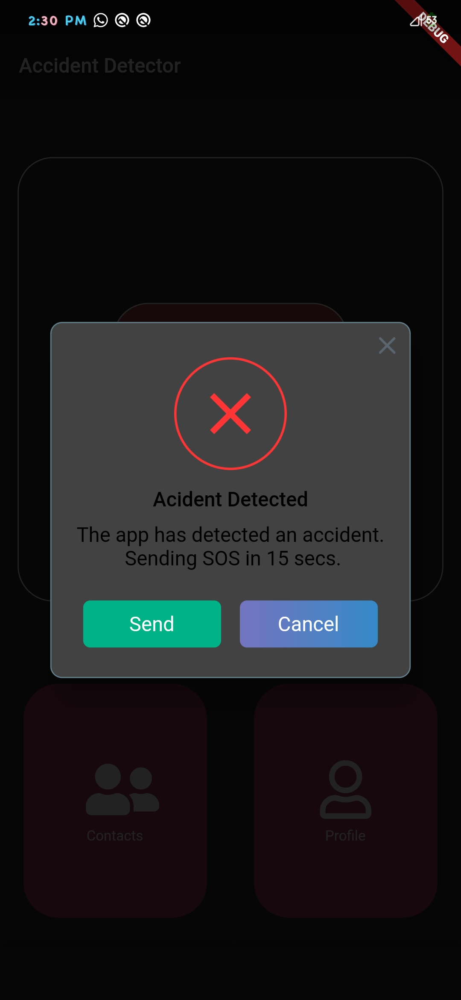
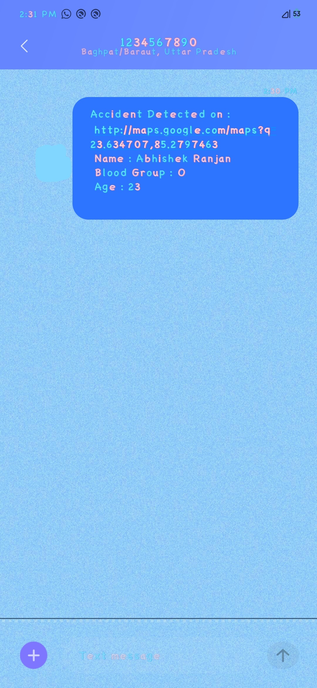

# accident_detector

## About the App
The app is for emergency services when a user encounters an Accident and needs immediate medical services.
The main problem is that emergency services often take too much time to reach the spot. As several accidents happen in remote areas where there's very few people who can help.
The App provides a solution as it detects potential accidents and in case of emergency sends the location of the user to his Emergency Contacts stating that user might have encountered an accident and immediate help is required.

## Dependencies
  cupertino_icons: ^0.1.3
  shared_preferences: ^0.5.10
  sensors: ^0.4.2+4
  sms_maintained: ^0.2.5
  location: ^3.0.2
  font_awesome_flutter: ^8.8.1
  rflutter_alert: ^1.0.8

## How to install
-> Clone this repo -> Go to pubsec.yaml and run "packages get" to update pakages used in the project.

## Apk Download Link
[Google Drive Link](https://drive.google.com/file/d/117Jd1aBzYBUSJhvxj74ujYB3PsVcheQE/view?usp=sharing)

## Screenshot

